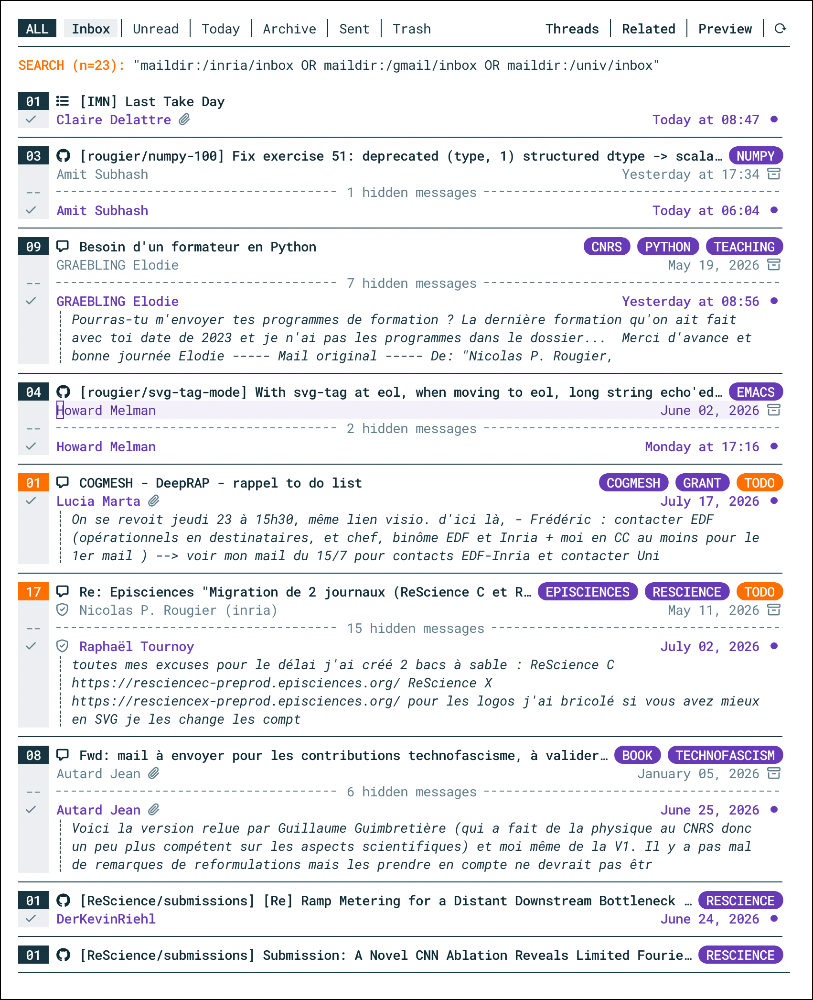

# NANO mu4e

## Introduction

NANO-mu4e is a minor mode for
[mu4e](https://www.djcbsoftware.nl/code/mu) that offer an alternative
layout for headers view when threads are enabled.

- Threads are clearly separated and centered on the subject
- Tags are shown only on the thread subject line
- Unread mails are clearly marked
- New mails can be previewed in headers view
- Marks are made more salient
- Thread folding is adapted to the style.  

**NOTE:** nano-mu4e requires [NERD fonts](https://www.nerdfonts.com/).

## Simple style

```text
[15] Thread subject 1                                               TAG-1 TAG-2
     Initial sender                                                   Yesterday
 --  --------------------------- 12 hidden messages --------------------------- 
     Recipient 1                                                 Today at 10:21
     ┊ New message content can be displayed inside the header view.
     Recipient 2                                                 Today at 11:07

[ 1] Thread subject 2                                                     TAG-3
     Initial sender                                              Today at 10:32
```


## Regular style

```text
[15] Thread subject 1                                               TAG-1 TAG-2
     Initial sender                                                   Yesterday
 --  --------------------------- 12 hidden messages --------------------------- 
     Recipient                                                   Today at 10:21 
     ┊ New message content can be displayed inside the header view.
     Recipient 2                                                 Today at 11:07 
───────────────────────────────────────────────────────────────────────────────
[ 1] Thread subject 2                                                     TAG-3
     Initial sender                                              Today at 10:32
───────────────────────────────────────────────────────────────────────────────
```


## Compact style

```text
┌─────────────────────────────────────────────────────────────────────────────┐
│ [15] Thread subject 1                                           TAG-1 TAG-2 │
│      Initial sender                                               Yesterday │
│  --  ------------------------- 12 hidden messages ------------------------- │
│      Recipient 1                                             Today at 10:21 │
│      ┊ New message content can be displayed inside the header view.         │
│      Recipient 2                                             Today at 11:07 │
├─────────────────────────────────────────────────────────────────────────────┤
│ [ 1] Thread subject 2                                                 TAG-3 │
│      Initial sender                                          Today at 10:32 │
└─────────────────────────────────────────────────────────────────────────────┘
```


## Boxed style

```text
┌─────────────────────────────────────────────────────────────────────────────┐
│ [15] Thread subject 1                                      TAG-1 TAG-2 [15] │
│      Initial sender                                               Yesterday │
│  --  ------------------------- 12 hidden messages ------------------------- │
│      Recipient 1                                             Today at 10:21 │
│      ┊ New message content can be displayed inside the header view.         │
│      Recipient 2                                             Today at 11:07 │
└─────────────────────────────────────────────────────────────────────────────┘
┌─────────────────────────────────────────────────────────────────────────────┐
│ [ 1] Thread subject 2                                                 TAG-3 │
│      Initial sender                                          Today at 10:32 │
└─────────────────────────────────────────────────────────────────────────────┘
```


# Usage

When in mu4e-headers-mode, you can type:

```emacs-lisp
(nano-mu4e-mode)
```

# Screenshots

Using headers view regular style and round tags style.

[](./nano-mu4e.png)


